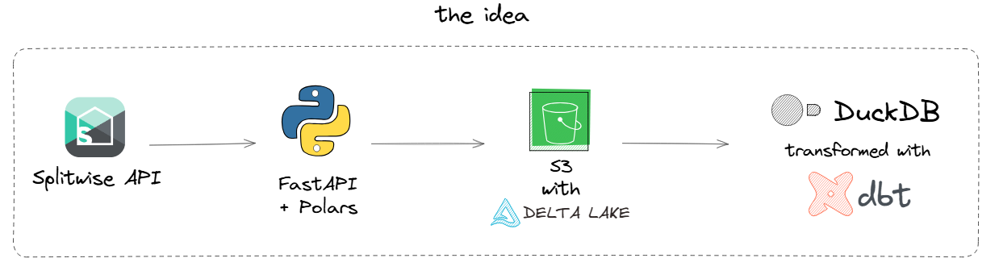

# My Splitwise Connector


<p align="center">
  <a href="https://www.python.org/">
    
  </a>
  <a href="https://fastapi.tiangolo.com/">
    
  </a>
  <a href="https://delta.io/">
    
  </a>
  <a href="https://aws.amazon.com/s3/">
    
  </a>
  <a href="https://duckdb.org/">
    
  </a>
  <a href="https://www.getdbt.com/">
    
  </a>
</p>

## Overview

This project is a Python application that uses FastAPI to act as a proxy, facilitating the consumption of information from [Splitwise](https://splitwise.com). The obtained data is stored in its raw format as Delta Lake tables in an S3 bucket on AWS. Furthermore, the project has connectors to create and store tables in a DuckDB database. A dbt (Data Build Tool) project is also integrated with DuckDB to perform transformations and analysis on the stored data.

## Project Architecture




## Features

- **Splitwise Data Collection:** Use the Splitwise API to obtain planned information on expenses, balances, and groups.
- **Storage in Delta Lake:** Ensure persistence of raw data with ACID transactions and versioning.
- **Integration with DuckDB:** Creates tables in DuckDB from data stored in S3.
- **Transformations with dbt:** Apply transformation models to raw data to generate insights and analysis.
- **Scalability and Resilience:** The use of AWS S3 and Delta Lake ensures that the system is highly scalable and resilient.

## Prerequisites

- **Python 3.8 or higher** and libraries in `requirements.txt`, or a Docker container that runs this environment.
- **AWS account** and user with read and write permissions on S3 - IAM recommended.
- **Splitwise account** with developer permissions.

## Installation

1. Clone the repository:
    ```
    git clone https://github.com/usuario/splitwise-connector.git
    ```

2. Install project dependencies:
    ```
    pip install -r requirements.txt
    ```

3. Configure allowed environment variables, such as Splitwise API keys and AWS credentials, using an .env file.
    ```
    # splitwise settings
    CONSUMER_KEY='<your key here>'
    CONSUMER_SECRET='<your key here>'
    API_KEY='<your key here>'

    # aws settings
    AWS_ACCESS_KEY_ID="<your key here>"
    AWS_SECRET_ACCESS_KEY="<your key here>"
    AWS_S3_ALLOW_UNSAFE_RENAME=true
    ```
4. Run a FastAPI application:
    ```
    uvicorn main:app --reload
    ```

## Contributions
Feel free to contribute to the project. To do this, fork the repository and send a pull request with your improvements.